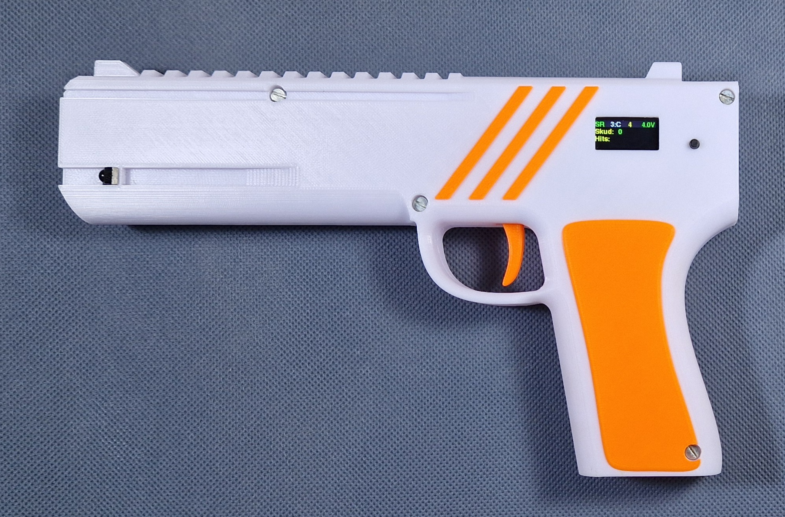
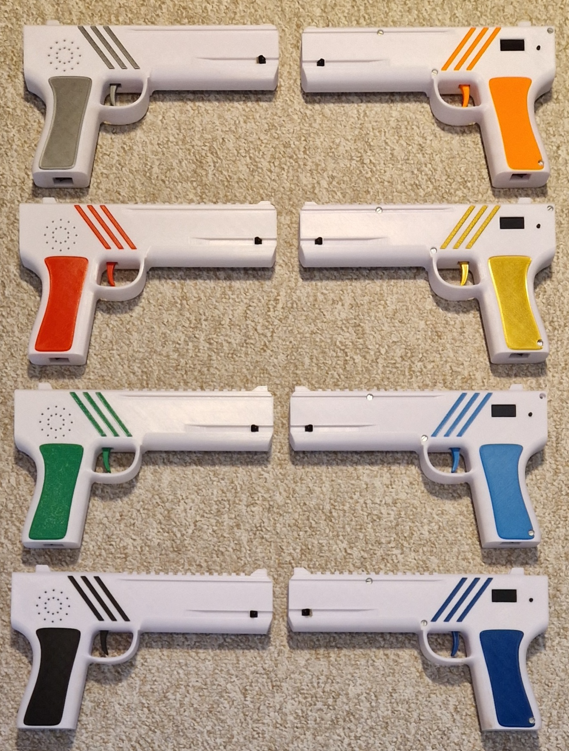
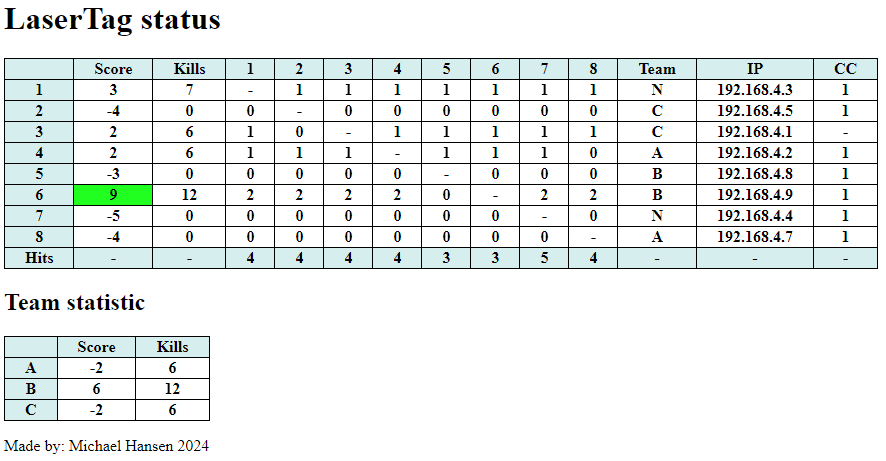
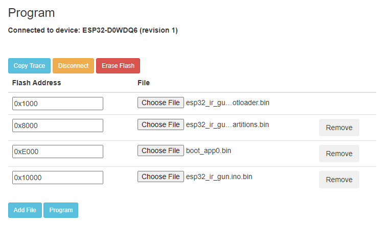

# HomGuns - Laser Tag Guns
Here are my laser tag guns.  
 

They work both indoor and outdoor and are able to communicate with each other, so both the target and the shooter knowns when a person is hit.  
When the fight is over a complete status is available as a web page on the main gun.  
They are made completely from scratch, with a custom made PCB, Arduino programming and 3D print. They are self-contained so no vest is required and with a rechargeable battery.

## How to play
### Game mode (WiFi connected mode)
1. (All guns must be in WiFi mode with one Server - see Configuration)
1. For each gun, select the team and then exit the configuration and power off the gun
1. Power on all guns (sequence doesn't matter). **The guns must not be powered off before the game is over and the statistic is shown!**  
1. On the **Server gun**, enter configration and setup the game: Laser **Power**, **Pre**-time and **Play**-time and exit configration
1. Press short config button to toggle between **Game** screen and **Status** screen.
1. In **Game** screen: Long press config button to start the game (All guns says: **Get ready**)
1. (All guns are cleared, the laser power is set to Server laser power, and all guns are locked until the pre-timer ends)
1. When the Pre-timer ends, then the gun vibrate and un-lock. The game is active. A game timer is shown on the display.
1. When the game timer ends, the gun says **Game over** and lock the gun.
1. When all have returned (are close to each other), then on the **Server** gun enter **Game** screen and long press to force update statistic from all guns.
1. Use a browser to connect to WiFi access point: **MH GUNS** and IP= **192.168.4.1** to see the complete status

Score is kills-hits. The green color marks the winner.  
If a gun is powercycled during gameplay, then it is marked as red under CC and the statistic is not valid. (The reason is that part of the statistic is saved on each gun, which is lost if powered off.)  
There can be a maximum of 10 guns connected in WiFi mode (ESP32 library limitation)

### Old mode (no WiFi mode)
1. Setup all guns (see below)  
1. Power on all guns (sequence doesn't matter)  
1. Play - have fun  

### Advanced info
The person that shoot and hit first has the advantage - the killed person should escape.
- If hit, the gun is stunned - can't shoot for 1.5 sec, but can still be hit! (try to run away)
- If hit during stunned mode, the gun is 'dead'- can't shoot for 3 sec and can't be killed for 2 sec. (2 sec to run away)

The LCD display information is:  

## Configuration
### Change the configuration:  
You navigate with 
- Short press: next item
- Long press: enter/save item
The changes are automatic saved when the configuration is exited.

### Initial Configuration (setup)
Before the guns can be used for the first time, some configuration is needed.  
The initial configuration is entered by **holding down the configration button during power-up**.  
- Mode: TAG (TARGET is for future use)
- Each gun must have a **unique** gun id
- If WiFi mode is used (recommended) then ONE gun must be **Server** and all the others must be **Clients**.
- Hardware options (LCD display)  

### Normal Configuration
The normal configuration is entered when the gun is powered on and then **long press the config button on the gun**  
- The IR power level must be set [1-4] 1: indoor, 4 outdoor
- Each gun must select a team (A, B, C or None (all against all))
- Sound: Level (Off, Low, Medium or High)
- Charge mode: Off, On (not required but makes a graph during charging)

## WiFi mode
In WiFi mode the guns can communication with each other and at the end of play, the complete status of the game can be seen on a WEB page.  
When connected, the shooting gun will light green when it hits another gun.
- ONE gun is setup as a WiFi access point (server)
- All the other guns are setup as clients
- When end of game, short press the config button on the server gun to force all client to re-send all hit data in case some was lost during transmission.
- The server also have a build-in WEB page that can be access with a browser: SSID: MH GUNS, IP: 192.168.4.1

## Charging
A fully charged gun can work for app. 3 hours.  
Power on the gun and then insert a cable connected to a charger into the USB-C plug. The status screen will change to charge mode (autodetected)  
It take app. 2 hours to completely charge the gun.  
***NB: The gun can NOT power it self OFF, so it is important that the gun is NOT left with power ON.***

## Firmware update

To update the GUN firmware, use the following link:
https://espressif.github.io/esptool-js/

Connect the GUN with a USB cable and press **Connect** in the GUI.  
The binary files are placed in **/bin** directory and must be entered as follow:  
| Flash Address | File |
|---------------|------|
|0x1000|esp32_ir_gun.ino.bootloader.bin|
|0x8000|esp32_ir_gun.ino.partitions.bin|
|0xE000|boot_app0.bin|
|0x10000|esp32_ir_gun.ino.bin|

Press **Add File** to get more entries. It should look like this:  
  
To flash the GUN, press **Program**, and wait for the flashing to complete.  
Disconnect the GUN. The GUN firmware is now updated.

