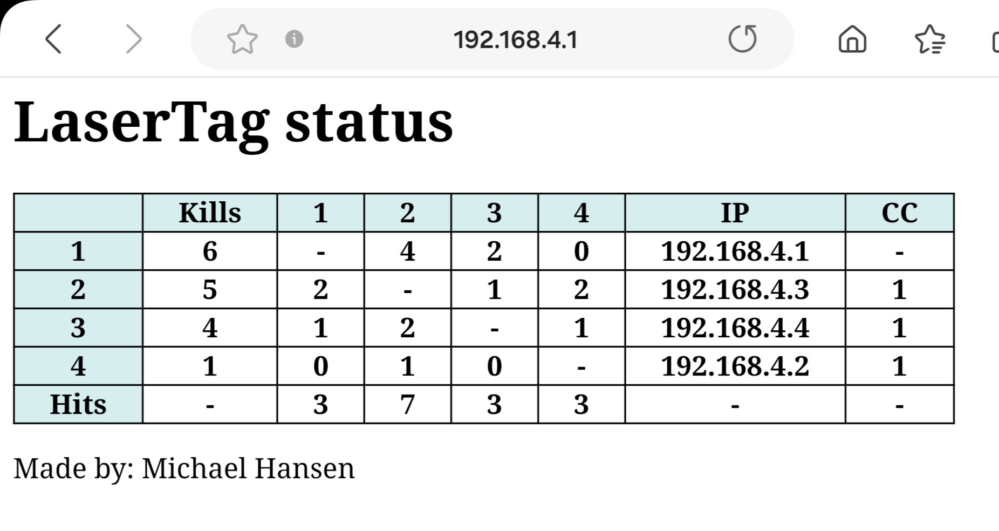

# LaserTag guns

When the game is finish, the complete status can be seen in a standard bowser:  

## How to play
1. Setup all guns (see below)  
1. Power off all guns  
1. Power on all guns (sequence doesn't matter)  
1. Play - have fun  
   If WiFI mode is used:
1. When end of play, on server gun short press config button  
1. Login to the  WiFi access point SSID: **MH GUNS**
1. Use a browser to access WEB page: IP: **192.168.4.1**

### Advanced info
The person that shoot and hit first has the advantage - the killed person should escape.
- If hit, the gun is stunned - can't shoot for 1.5 sec, but can still be hit! (try to run away)
- If hit during stunned mode, the gun is 'dead'- can't shoot for 3 sec and can't be killed for 2 sec. (2 sec to run away)

## Configuration (setup)
Before the guns can be used, some configuration is needed:
- Each gun must have a unique gun id
- Each gun must select a team (A, B or None (all against all))
- The IR power level must be set [1-4] 1: indoor, 4 outdoor
- If WiFi mode is used (see later) then ONE gun must be server and all the others must be clients. If WiFi mode is changed, then the gun will reboot when configuration is done.

### Change the configuration:  
Long press config button on gun  
You navigate with 
- Short press: next item
- Long press: enter/save item

<!-- -->

Items:
- Mode: TAG (TARGET is for future use)
- Power: 1 (indoor), 4 (outdoor)
- Id: Gun id, must be **unique** for all used guns
- Team: A or B, None is for all againt all
- Sound: Level (Off, Low, Medium or High)
- WiFi: Off, Server (only one gun), Client
- Charge mode: Off, On (not required but makes a graph during charging)
- Exit: Long press here to exit.

## WiFi mode
In WiFi mode the guns can communication with each other and at the end of play, the complete status of the game can be seen on a WEB page.  
When connected, the shooting gun will light green when it hits another gun.
- ONE gun is setup as a WiFi access point (server)
- All the other guns are setup as clients
- When end of game, short press the config button on the server gun to force all client to re-send all hit data in case some was lost during transmission.
- The server also have a build-in WEB page that can be access with a browser: SSID: MH GUNS, IP: 192.168.4.1

<!-- -->

## Firmware update

To update the GUN firmware, use the following link:
https://espressif.github.io/esptool-js/

Connect the GUN with a USB cable and press **Connect** in the GUI.  
The binary files are placed in **/bin** directory and must be entered as follow:  
| Flash Address | File |
|---------------|------|
|0x1000|esp32_ir_gun.ino.bootloader.bin|
|0x8000|esp32_ir_gun.ino.partitions.bin|
|0xE000|boot_app0.bin|
|0x10000|esp32_ir_gun.ino.bin|

Press **Add File** to get more entries. It should look like this:  
  
To flash the GUN, press **Program**, and wait for the flashing to complete.  
Disconnect the GUN. The GUN firmware is now updated.

