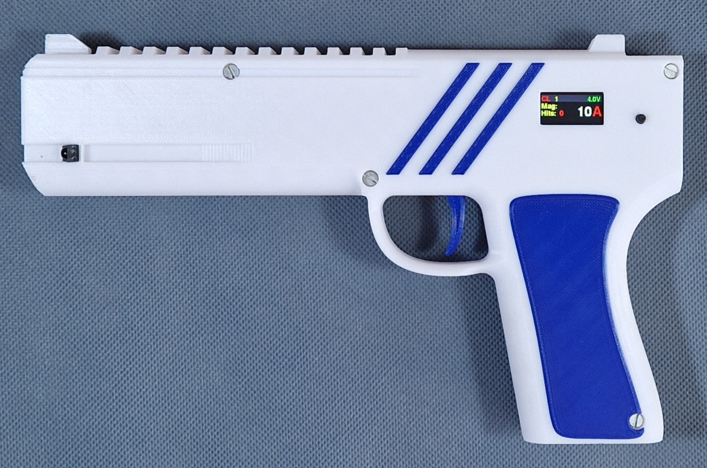
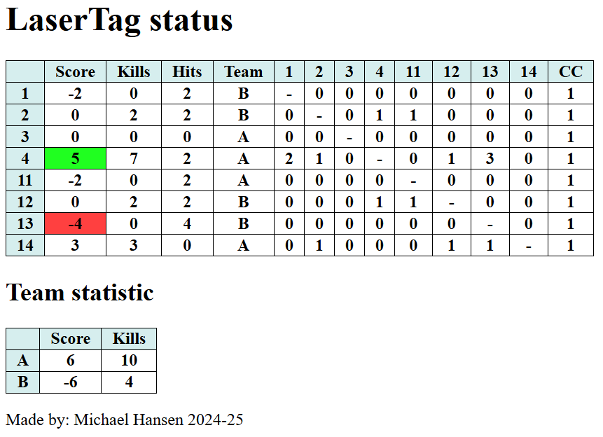
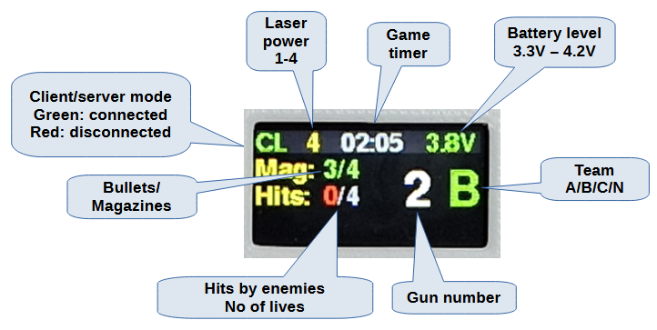
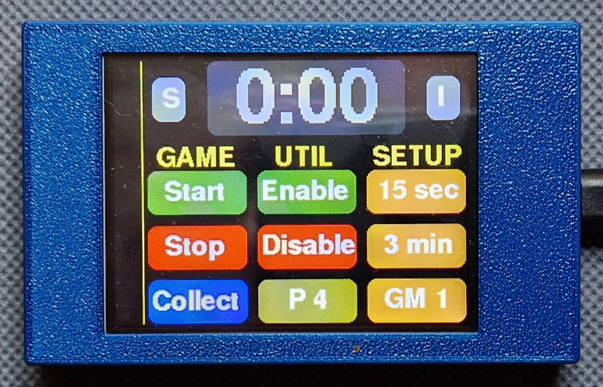
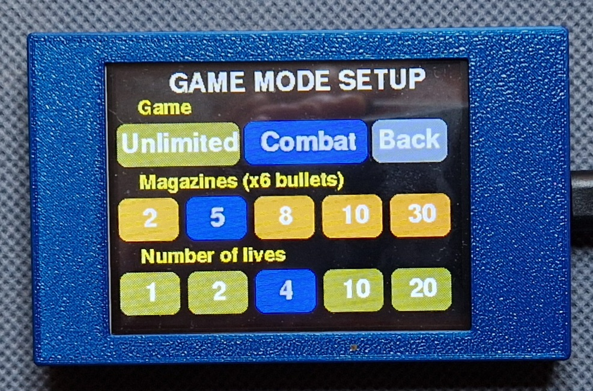

# HomGuns - Laser Tag Guns
Here are my laser tag guns.  
 

They work both indoor and outdoor and are able to communicate with each other, so both the target and the shooter knowns when a person is hit.  
When the fight is over a complete status is available as a web page on the main gun.  
They are made completely from scratch, with a custom made PCB, Arduino programming and 3D print. They are self-contained so no vest is required and with a rechargeable battery.  
Upto 16 guns are supported at the same time.

## How to play
### Game mode (Connected mode)
1. (All guns must be in "WiFi" mode with one Server - see Configuration)
1. For each gun, select the team
1. Power on all guns (sequence doesn't matter). **The guns must not be powered off during the game and until the statistic is shown!**  
1. On the **Server gun**, enter configration and setup the game (see later)
1. Press short config button to toggle between **Game** screen and **Status** screen.
1. In **Game** screen: Long press config button to start the game (All guns says: **Get ready**)
1. (All guns are cleared and setup as the server gun, and all guns are locked until the pre-timer ends)
1. When the Pre-timer ends, then the gun vibrate and un-lock. The game is active. A game timer is shown on the display.
1. When the game timer ends, the gun says **Game over** and lock the gun.
1. When all have returned (are close to the server gun), then on the **Server** gun enter **Game** screen and long press to force update statistic from all guns.
1. Use a browser to connect to WiFi access point: **MH GUNS** and IP= **192.168.4.1** to see the complete status

Score is kills-hits. The green color marks the winner, red marks the gun (person) died.  
If a gun is powercycled during gameplay, then it is marked as red under CC and the statistic is not valid. (The reason is that part of the statistic is saved on each gun, which is lost if powered off.)  

### Old mode (no WiFi mode)
1. Setup all guns (see below)  
1. Power on all guns (sequence doesn't matter)  
1. Play - have fun  

### Advanced info
The person that shoot and hit first has the advantage - the killed person should escape.
- If hit, the gun is stunned - can't shoot for 2 sec, but can still be hit! (try to run away)
- If hit during stunned mode, the gun is disabled- can't shoot for 4 sec and can't be killed for 2 sec. (2 sec to run away)

The LCD display information is:  

## Configuration
### Change the configuration:  
You navigate with 
- Short press: next item
- Long press: enter/save item
The changes are automatic saved when the configuration is exited.

### Initial Configuration (setup)
Before the guns can be used for the first time, some configuration is needed.  
The initial configuration is entered by **holding down the configration button during power-up**.  
- Mode: TAG (TARGET is for other use)
- Each gun must have a **unique** gun id [1-16]
- If connected mode is used (recommended) then ONE gun must be **Server** and all the others must be **Clients**.
- Hardware options (LCD display)  

### Normal Configuration
The normal configuration is entered when the gun is powered on and then **long press the config button on the gun**  
- The IR power level must be set [1-4] 1: indoor, 4 outdoor
- Each gun must select a team (A, B, C or None (all against all))
- Sound: Level (Off, Low, Medium or High)
- Charge mode: Off, On (not required but makes a graph during charging)

## Connected mode
In connected mode the guns can communication with each other and at the end of play, the complete status of the game can be seen on a WEB page.  
When connected, the shooting gun will light green when it hits another gun.
- ONE gun is setup as a WiFi access point (server)
- All the other guns are setup as clients
- When end of game, on the **server** gun, enter **Game** screen and long press the config button to force all client to re-send all hit data in case some was lost during transmission.
- A simplified gamastatistic is shown on the server gun (long press to exit - WEB server doesn't work when this list is active)
- The server also have a build-in WEB page that can be access with a browser: SSID: MH GUNS, IP: 192.168.4.1

### Gamemodes
Can only be setup on the **server gun**.  

| Gamemode | Description |  
|-------|------|
| Unlimited (Standard) |This is the standard mode when the guns are powered on. Here you have unlimited bullets and unlimited hits (you can't die).|
| Combat | In this mode you have a **number of magazines** with 6 bullets in each. When a magazine is empty you need to press the button on the side of the gun to change to a new magazine. If the magazine is not empty, the rest of the bullets in the magazine is lost! You have a **limited number of lives**, and when they are used you are dead (the gun doesn't work anymore). Combat mode can only be selected on the master gun i.e. you need to be in connected mode and in game mode in order to use it.|

For both modes, there is a **Pre** timer (time to hide) and a **Play** timer (game lenght).  

## Charging
A fully charged gun can work for app. 3 hours.  
Power on the gun and then insert a cable connected to a charger into the USB-C plug. The status screen will change to charge mode (autodetected)  
It take app. 2 hours to completely charge the gun.  
***NB: The gun can NOT power it self OFF, so it is important that the gun is NOT left with power ON.***  
If not used for 6 minutes (and not in gamemode or charging mode) the gun will say 'Idle'.

## Standalone server module (optinal)
I have made a standalone server controller, so it is easier to control the guns. The hardware is a Cheap Yellow Display (CYD) module, which is an ESP32 with a 2.8" touch screen, that is described here: https://randomnerdtutorials.com/cheap-yellow-display-esp32-2432s028r/.   
To use it, just download the esp32_ir_gun_server software and it is ready to use. All the guns must be in **Client** mode.  
The module has a large touch screen, where all the options are present in a menu system. In this way it is easier to setup and control the guns.  
 

## Firmware update

To update the GUN firmware, use the following link:
https://espressif.github.io/esptool-js/

Connect the GUN with a USB cable and press **Connect** in the GUI.  
The binary files are placed in **/bin** directory and must be entered as follow:  
| Flash Address | File |
|---------------|------|
|0x1000|esp32_ir_gun.ino.bootloader.bin|
|0x8000|esp32_ir_gun.ino.partitions.bin|
|0xE000|boot_app0.bin|
|0x10000|esp32_ir_gun.ino.bin|

Press **Add File** to get more entries. It should look like this:  
  
To flash the GUN, press **Program**, and wait for the flashing to complete.  
Disconnect the GUN. The GUN firmware is now updated.

