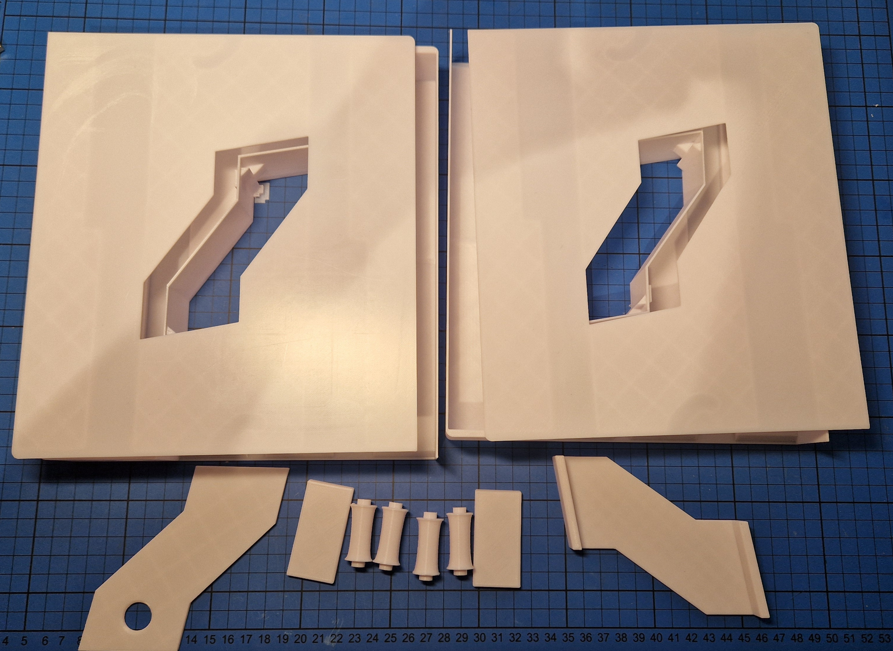

# Storage box

I have made a box for two guns, that can be stacked together. There is a storage hole in the middle, that span all the boxes.

The STL file contain all the parts, but it is important to select the correct parts to make a box. The parts depend on to number of boxes.

Before a box is glued together, it is important to add the spring wire, as shown in this short video:

https://github.com/mhfalken/esp32_ir_gun/tree/main/box/spring-wire.mp4

The spring wire I use is a piano wire of 0.80 mm. It is a bit of an art to bent the wires to fit the need. 
The foam part it added to make a better feel and to avoid that the gun rattles during transport. 

The box is glued together using cyanoacrylate.