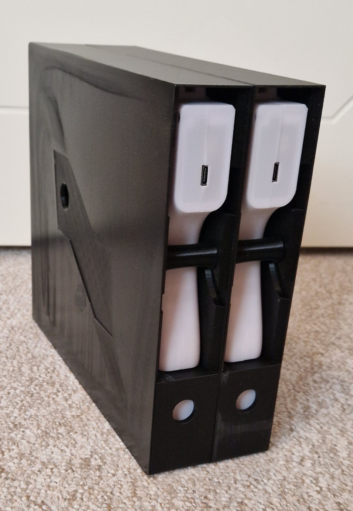
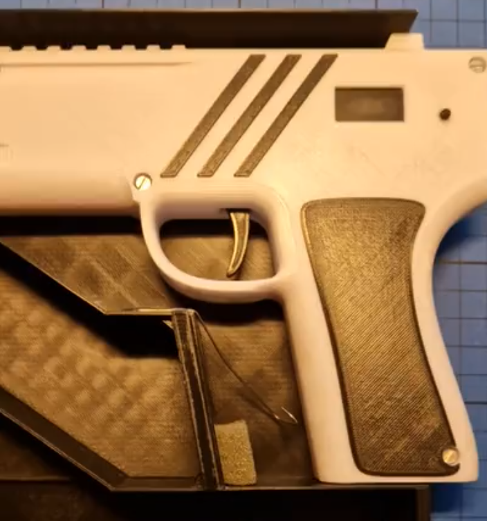

# Storage box

I have made a box for two guns, that can be stacked together. There is a storage hole in the middle, that span all the boxes.

The STL file contain all the parts, but it is important to select the correct parts to make a box. The parts depend on the number of boxes.

  

Before a box is glued together, it is important to add the spring wire, as shown in this picture:

 

Here is a short video, that demonstrates how it works:
https://github.com/mhfalken/esp32_ir_gun/tree/main/box/box-spring-wire.mp4

The spring wire I use is a piano wire of 0.80 mm. It is a bit of an art to bend the wire to fit the need. 
The foam part is added to make a better feel and to avoid that the guns rattles during transport. 

A box is glued together using cyanoacrylate.  
Boxes are stacked together using the inserts (no glue is needed).
