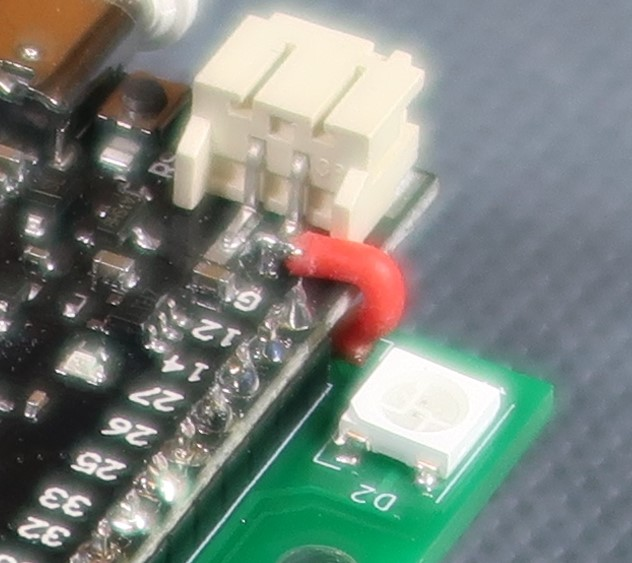
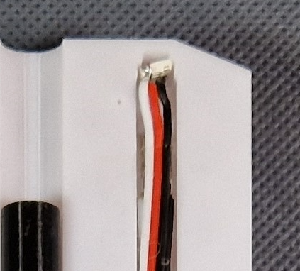

# Hardware overview

## Hardware components (for one gun)

| Count | Component | Info | Link (Aliexpress) |
|-------|------|-----|--|
| 1| CPU board | ESP32 board |https://www.aliexpress.com/item/1005006982480169.html | 
| 1| Display | LCD 0.96" 80x160 | https://www.aliexpress.com/item/1005005300940624.html|
| 1| Amplifier board| PAM8302| https://www.aliexpress.com/item/32686733187.html|
| 2| IR receivers | TSOP32240 | https://www.aliexpress.com/item/1005005665455510.html|
| 1| IR transmitter | VSLY5940| https://www.aliexpress.com/item/1005005262125949.html|
| 1| Config button |6x6x10 | https://www.aliexpress.com/item/4001166999847.html|
| 1| Trigger button | 6x6x4.3| https://www.aliexpress.com/item/4001166999847.html|
| 5|NEO pixels | SMD 5050| https://www.aliexpress.com/item/1005002653014067.html|
|9| Resistors| SMD 0805 ||
|2|100-220uF| SMD C | https://www.aliexpress.com/item/1005005691643122.html |
|1|4.7uF | SMD 1206|
|1|1N5819ws | SMD 0805 / SOD 323 | https://www.aliexpress.com/p/order/index.html|
|2| nFET | SI2302 or SI2300 SOT23 ||
|1| NPN | FMMT617 SOT23 ||
|1| Haptic feedback motor| 3.7V/16000 | https://www.aliexpress.com/item/1005003099287631.html |
|1|Speaker | diameter=36 mm| https://www.aliexpress.com/item/1005002939305602.html |
| 1|Power switch | 10x15 | https://www.aliexpress.com/item/1005005495319044.html|
| 1|Battery | Li-ion 14500 | https://www.aliexpress.com/item/1005005687014456.html|
|3| M3 screw | 6mm (PCB mount)| |
|1| M3 screw |  10 mm (trigger)| |
|4| M3 screw  | 20 mm (gun assembly)| |

0.5 m various single wires  
0.7 m servo wires (3 wires together)  
1x PCB  
1x 3D print  

## Tips
In generel look at the pictures in git-images, to see how it is supposed to look like.   
Remember the red wire shown on charger-wire.jpg. Without it, it won't work! (It is the only way to connect the battery to the CPU board without using the plug, which there is no room for.)  
  

The last NEO pixel should be mounted in the tip of the gun and connected with wires to the main board.  
  

It is a good idea to program the CPU board before mounting it. In this way it is very easy to check it is working when assempling it.  
Mount all the components on the PCB first, then mount the three add-on boards.  

